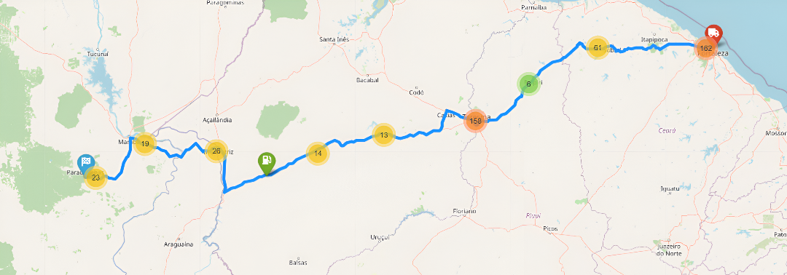

# 🛣️ Roteirização de Caminhões com Postos Próximos à Rota



Este projeto utiliza APIs geoespaciais para traçar rotas otimizadas para caminhões, identificando postos de combustível e locais de descanso próximos à rota principal.

## 🔧 Tecnologias Utilizadas
- Python 3.8+
- OpenRouteService API
- Overpass API
- Folium
- Geopy
- Shapely

## 🚀 Instalação

Siga estes passos para configurar o ambiente:

1. **Clone o repositório**:
   ```bash
   git clone https://github.com/seu-usuario/rota-caminhoes.git
   cd rota-caminhoes
